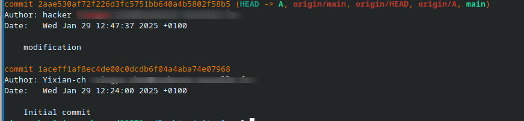
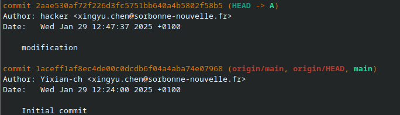
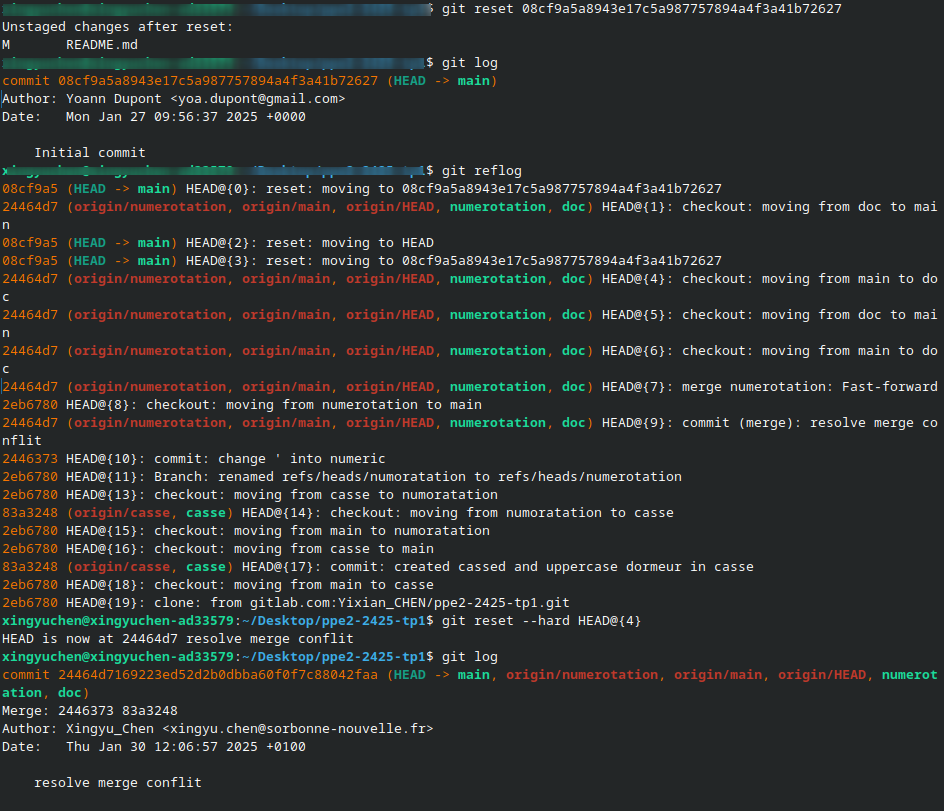
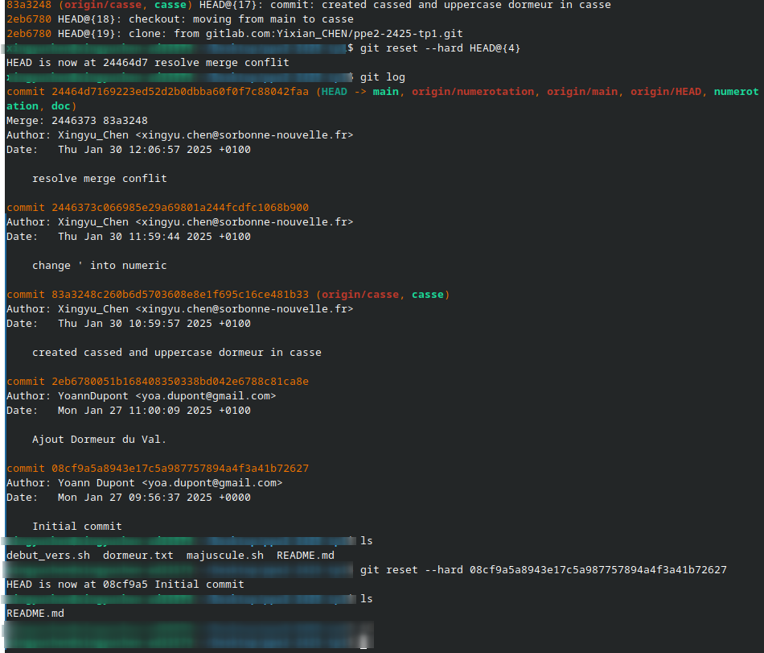
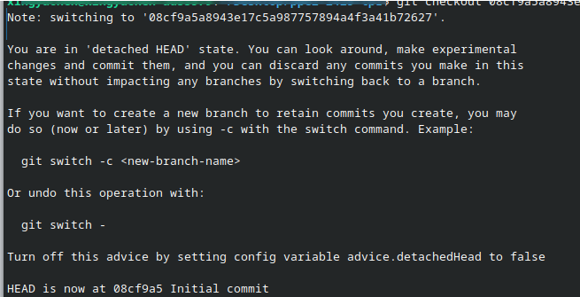
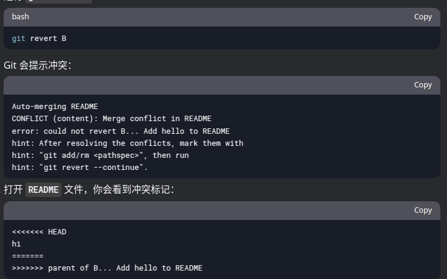
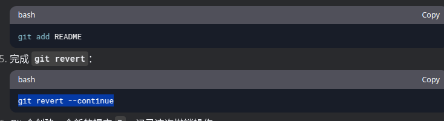

# PPE2-2024
## 1ER Séance 29/01/2025
### Git branche
- **note that branch is not like a new word, its a commit that takes what has been done and do something different from other branches like main**
- `(origin/main, origin/HEAD, main)` the two first text are red, the first is on Internet, what users will observe, it tells us they are in main branch, the Head commit (the last commit pushed), the third zone is all branches we have locally. 
- `git branche <name> [reference]` copy a branch from a certain commit id and create
- `git branche -d <name>`  delete requiring merge changes of current branche with main branche  otherwise git will not delete, with -D force deleted 
- `git branche -m/-c <name>` create a branch from the head
- `git checkout [-b] <branche>` swith to another branche, -b can create a new branche and swith to it en passage.
- `git switch [-c] <branche>` more simple, once swith to another git, it will switch to the branche distance synchronized.
- `git push --set-upstream origin <branche>` this will create the new branche from origin branch and pushi
- `git rebase <commit>` copy the commit and send it to main branche
- `git merge <branche>` actulize current branche with other branches in <>
- the ORIG_HEAD is a reference created automaticcaly by git to keep files before commit like rebase, reset, merge to make sure we have a copy if something goes run
- the HEAD reference is kind like a cursor for git that helps git to locate current workflow. Based on it, it know on which branche we work
-  in this example, we can know that this commit is in the same level HEAD of both branches
-  
this one is before we use git merge <branche> to synchronize branche A changes to branche main, so the branche main will not appear.

### merge conflit
- the merge has different modes, for instance fastforward, recursive..
- if we do changes on a same file but in different branches, merge can work, but it will quote all changes made in different branches need us to do modification beacuse branches do not have the same parent, they diverge
- if we modify files in one branche without adding or commiting, then switch to another branche, all modifications will operate on this branche, changes like this are kept in log or a workplace with a reference to know on which branche changes are  done, once we commit is, changes will finally apply on that branche. Just pay attention, before switch to other branche, commit works done on current branche
- divergence problem, collaborator and we work on a project in the same time, but he pushed before than you and our local version now diverges with main version, like two points go to different direction from one point, then we can merge them by choosing wich branch / commit to merge 
### Git config
- `git confit --global init.defautBranch <name>` set a defaut name for the branch once we creat a new git resp
- `git config user.name <name>` change name appears in commit
- 'git config user.email <mail>' same
- create a .gitignore file then write which resp you do not git to track, the gitignore file saves automatically in .git 
### 1er exercice
- Pour les 2 premiers exercices j'ai écrit des script sur deux branches différentes.
- 3ème exo : conflit que j'ai eu pendent le merge se trouve dans le fichier dormeur qui a été modifié dans deux branches, et dans ce cas-là git va souligner les modifications effecturées respectivement de chaque branche, et pour les autres contenus qui a été d'abord modifé dans la branches casse va remplacer les mêmes textes qui n'a pas été modifiés dans la branche numerotation. En gros, le merge = synchronisation avec une autre branche, on prend les choses uniques de la branche, on les mets dans la branche synchronisée, s'il rencontre des modifications sur un même fichier, git va mettre les modifications de deux branches et laisse l'utilisateur à choisir.
- 4ème exo : d'abord j'ai essayé git reset --hard qui est très puissant, on retourne au commit donné et on va perdre les modifications non add, puis j'ai essayé git checkout et j'ai eu conflit comme
-    
- Avec git reflog on peut trouver le curseur de git où il était c'est comme gitlog mais on voit le trajectoire de git. 
- Avec git checkout, on arrive à l'état de commit donné mais on est dans quelque part de git workflow, c'est pour faire des commits d'essaie sans impacter les branches, c'est comme on fait qqch à part, si on pense qu'elles sont utiles, on les utilise

### Revert conflit
- When your commit and the commit you want to revert have done changes on a same file, on same place, git will show you both changes, let you to decide
- 
- 

## 2EM Séance
### Pour checkout
- `git checkout -b new_branch branch` cela permet de créer une branche avec une référence
### EXO2
- `git branch -m old_name new_name` `git push origin --delete branch` to rename a branch pushed to avoid current working branch dismatch. But the git is still tracking the old deleted branch which is the upstream branch of the renamed branch, so we need to tell git do not track it anymore. Your branch is based on 'origin/r3', but the upstream is gone. (use "git branch --unset-upstream" to fixup)

## 3EM Séance
### Travails entre membres
- Lorsqu'on fait le merge, on modifie le moindre possible les fichiers, et ne modifie pas la fonction des autres.
