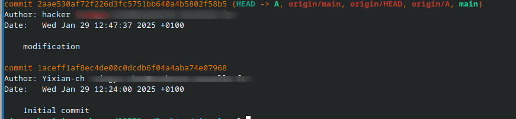
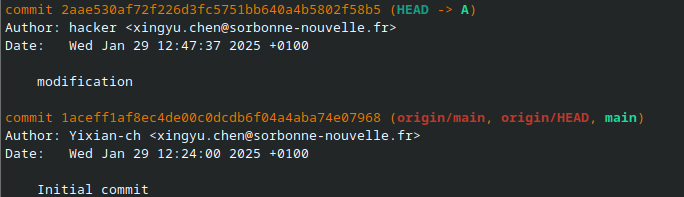

# PPE2-2024
## 1ER Séance 29/01/2025
### Git branche
- `(origin/main, origin/HEAD, main)` the two first text are red, the first is on Internet, what users will observe, it tells us they are in main branch, the Head commit (the last commit pushed), the third zone is all branches we have locally. 
- `git branche <name> [reference]` copy a branch from a certain commit id and create
- `git branche -d <name>`  delete requiring merge changes of current branche with main branche  otherwise git will not delete, with -D force deleted 
- `git branche -m/-c <name>` create a branch from the head
- `git checkout [-b] <branche>` swith to another branche, -b can create a new branche and swith to it en passage.
- `git switch [-c] <branche>` more simple, once swith to another git, it will switch to the branche distance synchronized.
- `git push --set-upstream origin <branche>` this will create the new branche from origin branch and pushi
- `git rebase <commit>` copy the commit and send it to main branche
- `git merge <branche>` actulize current branche with other branches in <>
- the ORIG_HEAD is a reference created automaticcaly by git to keep files before commit like rebase, reset, merge to make sure we have a copy if something goes run
- the HEAD reference is kind like a cursor for git that helps git to locate current workflow. Based on it, it know on which branche we work
-  in this example, we can know that this commit is in the same level HEAD of both branches
-  
this one is before we use git merge <branche> to synchronize branche A changes to branche main, so the branche main will not appear.
### merge conflit
- the merge has different modes, for instance fastforward, recursive..
- if we do changes on a same file but in different branches, merge can work, but it will quote all changes made in different branches need us to do modification beacuse branches do not have the same parent, they diverge
- if we modify files in one branche without adding or commiting, then switch to another branche, all modifications will operate on this branche, changes like this are kept in log or a workplace with a reference to know on which branche changes are  done, once we commit is, changes will finally apply on that branche. Just pay attention, before switch to other branche, commit works done on current branche
- divergence problem, collaborator and we work on a project in the same time, but he pushed before than you and our local version now diverges with main version, like two points go to different direction from one point, then we can merge them by choosing wich branch / commit to merge 
### Git config
- `git confit --global init.defautBranch <name>` set a defaut name for the branch once we creat a new git resp
- `git config user.name <name>` change name appears in commit
- 'git config user.email <mail>' same
- create a .gitignore file then write which resp you do not git to track, the gitignore file saves automatically in .git 
